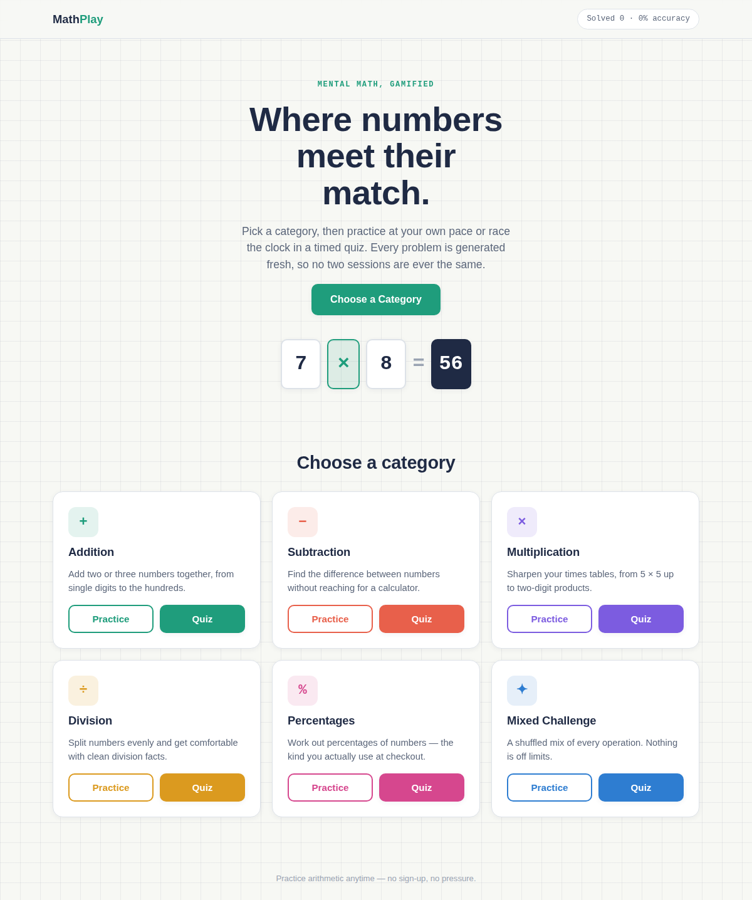
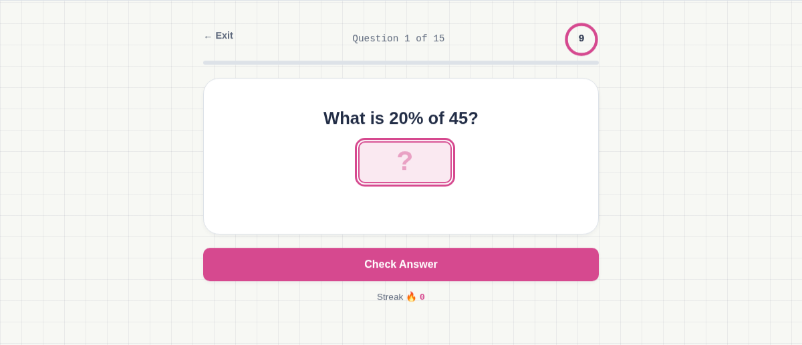
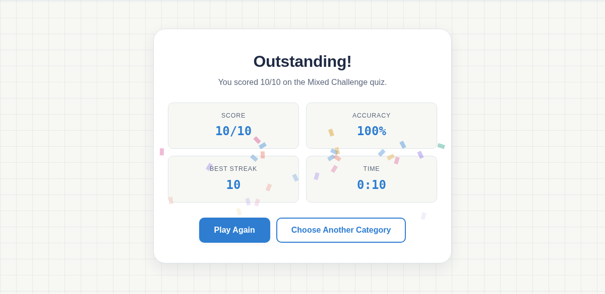

<div align="center">

# 🔢 MathPlay

### Where numbers meet their match.

A fast, friendly web game for practicing mental math — addition, subtraction, multiplication, division, and percentages. Practice at your own pace, or race the clock in a timed quiz.

**[🚀 Play the Live Demo](https://vishal-git-dot.github.io/mathplay/)**


</div>

---

## ✨ Preview

<p align="center">
  
</p>

<p align="center">
  
  
</p>

## 🎯 Features

- 🧮 **6 categories** — Addition, Subtraction, Multiplication, Division, Percentages, and a Mixed Challenge that shuffles them all
- ♾️ **Unlimited unique questions** — every problem is generated procedurally, not pulled from a fixed bank, so no two sessions are the same
- 🎮 **Two ways to play**
  - **Practice** — untimed, with instant feedback and a worked explanation for every answer
  - **Quiz** — timed, scored, with a results summary at the end
- ⏱️ **Per-question countdown timer** in quiz mode, with a ring that turns red as time runs low
- 🔥 **Streak tracking** plus a running accuracy/solved counter
- 🎉 **Confetti celebration** for strong quiz scores, with a headline that adapts to performance
- 📱 **Fully responsive** — phone, tablet, and desktop
- ⚡ **Zero dependencies** — plain HTML, CSS, and JavaScript, no build step, no frameworks
- ♿ **Accessible** — keyboard support, visible focus states, and reduced-motion support

## 🛠️ Tech Stack

| | |
|---|---|
| Markup | HTML5 |
| Styling | CSS3 (custom properties, Grid, Flexbox, keyframe animations) |
| Logic | Vanilla JavaScript (ES6+) |
| Fonts | [Space Grotesk](https://fonts.google.com/specimen/Space+Grotesk), [JetBrains Mono](https://fonts.google.com/specimen/JetBrains+Mono), [Inter](https://fonts.google.com/specimen/Inter) via Google Fonts |

No npm, no bundler, no external JS libraries.

## 📦 Getting Started

Clone the repo:

```bash
git clone https://github.com/vishal-git-dot/mathplay.git
cd mathplay
```

Then just open `index.html` in your browser — or serve it locally:

```bash
python3 -m http.server 8000
# visit http://localhost:8000
```

### Project structure

```
mathplay/
├── index.html        # App structure & all screens
├── style.css          # Design tokens, layout, animations
├── script.js           # Question generators & app logic
└── screenshots/         # Images used in this README
```
## 🧩 How Questions Are Generated

Each category has its own generator function, and difficulty (Easy / Medium / Hard) scales the number ranges. A few guarantees:

- Division facts always divide evenly
- Percentage questions always resolve to whole numbers
- Questions don't repeat within the same session

## 🤝 Contributing

Contributions, issues, and feature requests are welcome — feel free to check the [issues page](../../issues).

1. Fork the project
2. Create your feature branch (`git checkout -b feature/amazing-idea`)
3. Commit your changes (`git commit -m 'Add amazing idea'`)
4. Push to the branch (`git push origin feature/amazing-idea`)
5. Open a pull request

## 📄 License

No license has been set yet. [MIT](https://choosealicense.com/licenses/mit/) is a common, permissive choice for projects like this — add a `LICENSE` file to the repo root to make it official.

---

<div align="center">

Made with 🧠 + ☕ — practice arithmetic anytime, no sign-up, no pressure.

</div>
